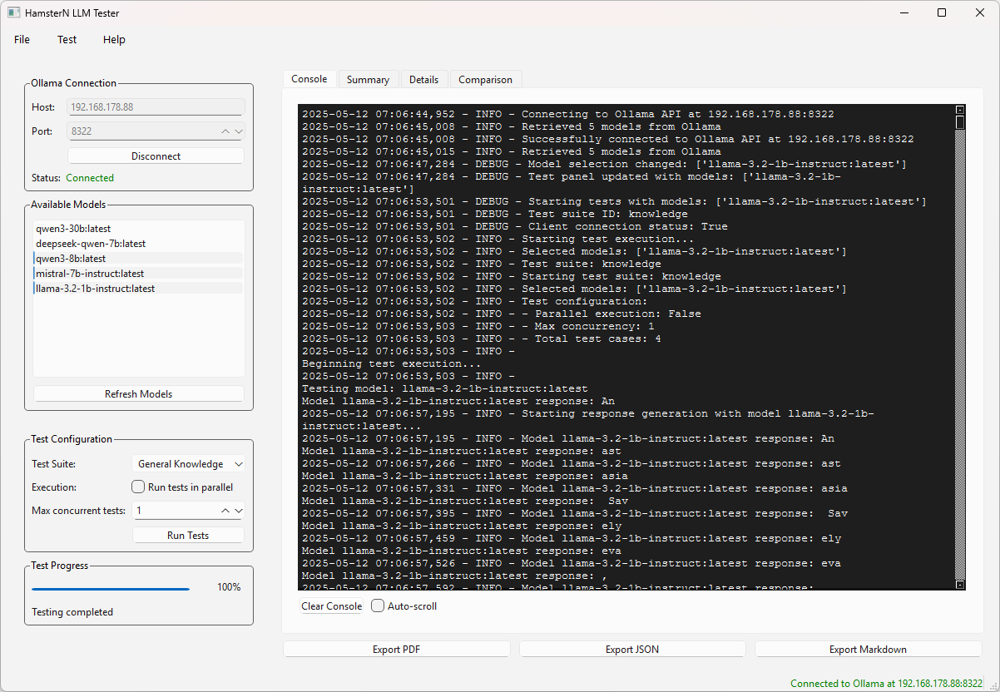
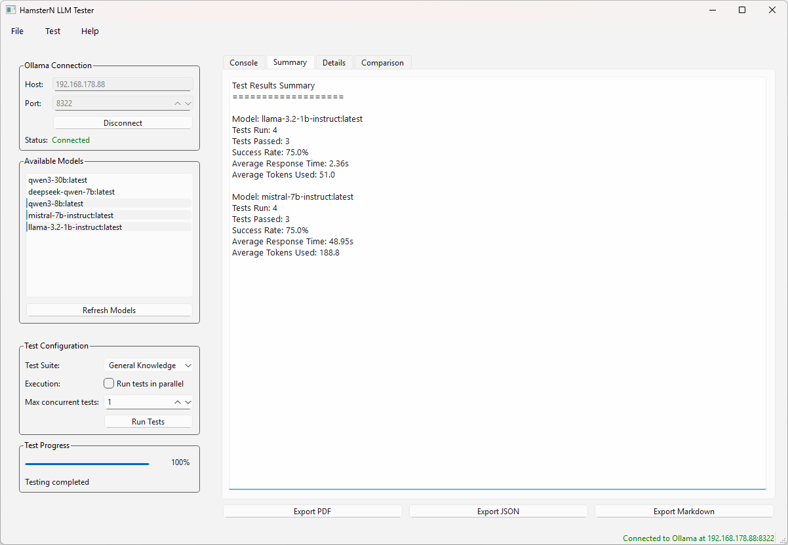
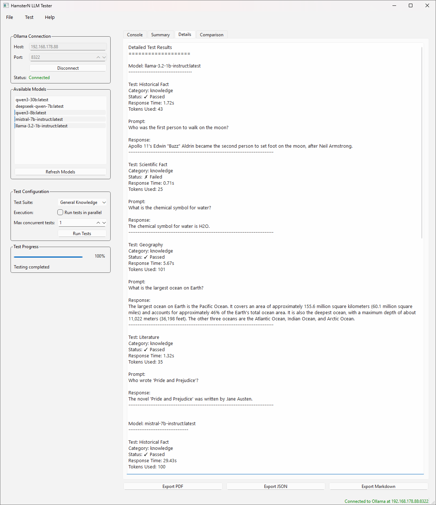
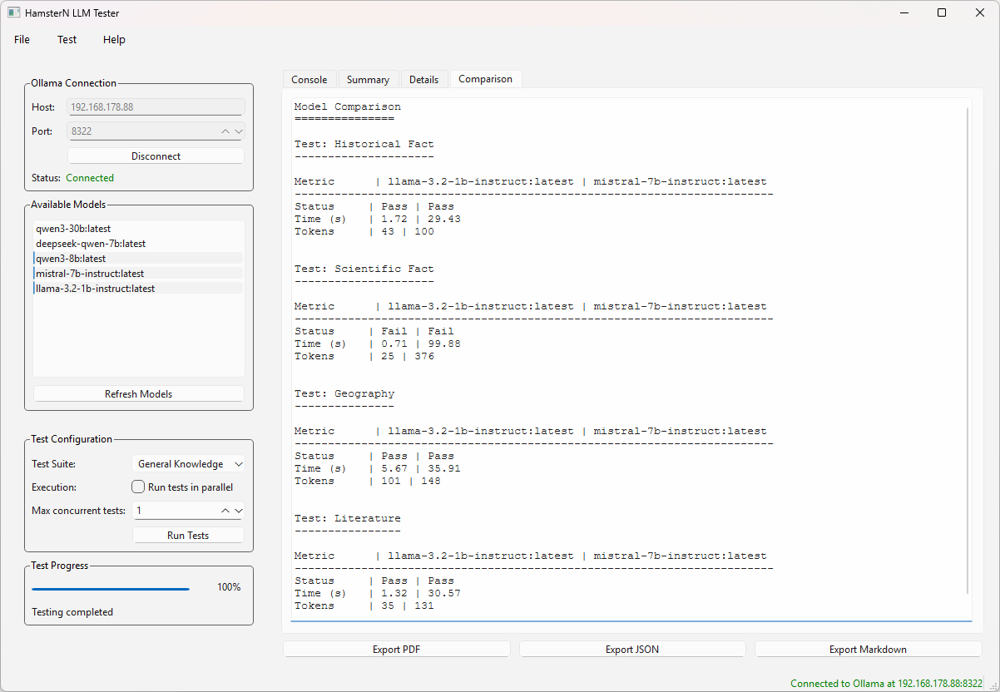

# 🤖 HamsterN LLM Tester

A versatile testing tool for evaluating Large Language Models through Ollama. This application provides a graphical interface for conducting systematic tests on LLM models, helping you assess and compare their performance. 🧠📊

## ✨ Features

- 🚀 Easy-to-use graphical interface
- 📊 Comprehensive test suites for model evaluation
- 🔄 Support for multiple Ollama models
- 📈 Performance comparison capabilities
- 🛠 Configurable test parameters
- 📝 Detailed test results and analysis

## 🖼️ Screenshots
<table>
  <tr>
    <td>
      <details>
        <summary>🖥️ Console</summary>
        
      </details>
    </td>
    <td>
      <details>
        <summary>📝 Summary</summary>
        
      </details>
    </td>
    <td>
      <details>
        <summary>📂 Details</summary>
        
      </details>
    </td>
    <td>
      <details>
        <summary>📊 Comparison</summary>
        
      </details>
    </td>
  </tr>
</table


## ✅ Prerequisites

- Windows operating system
- [Ollama](https://ollama.ai/) installed and running
- Any LLM models you want to test already pulled in Ollama

## ⚙️ Installation

1. Download the latest release from the [Releases](https://github.com/x3kim/LLM-Tester/releases) page ▶️
2. Extract the zip file to your desired location
3. Run `Start_LLMTester.bat` to launch the application ▶️

## 🚀 Usage

1. Launch the application using `Start_LLMTester.bat`
2. Configure your Ollama connection (default: `localhost:11434`)
3. Select the models you want to test from the available list 🤖
4. Choose a test suite from the dropdown menu 🧪
5. Click 'Start Test' to begin the evaluation ▶️
6. View and analyze the results in the application 📈

## 🧪 Test Suites

The application comes with several predefined test suites:
- Knowledge Tests 🤔
- Reasoning Tests 🧩
- More test suites coming soon... ✨

## 💻 Development

To set up the development environment:

```bash
# Clone the repository
git clone https://github.com/x3kim/LLM-Tester.git
```

# Create and activate virtual environment
```bash
python -m venv venv
.\venv\Scripts\activate
```

# Install dependencies
```bash
pip install -r requirements.txt
```

# Run the application in development mode
```bash
python -m src.main
```

## 🙏 Contributing
Contributions are welcome! Please feel free to submit a Pull Request. 🤝

## 📜 License
This project is licensed under the MIT License - see the LICENSE file for details.

## ⚠️ Beta Version Notice
This is a beta version of the software. While it is functional, you may encounter bugs or incomplete features. Please report any issues you find through the GitHub issues page. 🐛
